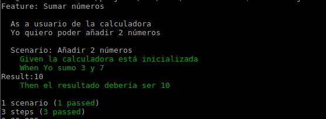

La aplicacion sobre la que vamos a realizar nuestras pruebas se basa en [Foodme](https://github.com/IgorMinar/foodme). 
Se ha adaptado el código para que funcione con versiones superiores del stack (angular, express).

**Ejecutar la aplicación con:**

      ./scripts/web-server.sh

Automáticamente se nos abrirá el navegador con la página principal de la aplicación:


## Pruebas unitarias


Objetivo: Ejemplo para calcular una suma y realizar un test, usando la sintaxis del framework Jasmine y TDD.


Revisar la [sintaxis de Jasmine](http://jasmine.github.io) antes de empezar.


1. Acceder a la carpeta 'test/unit'
2. Ejecutar ```jasmine init```

    Se creará una estructura de directorios 'spec/support' con el fichero jasmine.json

    ```javascript
    {
      "spec_dir": "spec",
      "spec_files": [
        "**/*[sS]pec.js"
      ],
      "helpers": [
        "helpers/**/*.js"
      ],
      "stopSpecOnExpectationFailure": false,
      "random": false
    }
    ```
    *Fijarse en donde espera encontrar las especificaciones de prueba y la extensión de las mismas.*

3. Definimos la prueba antes que el código: 'test/unit/spec/calculator_spec.js':

    ```javascript
    // Pruebas unitarias de una calculadora
    var calc = require('../calculator.js')

      describe('Calculadora', function() {

        beforeEach(function() {
        });

        afterEach(function() {        
        });

        describe('sumar', function() {
          it('deberia sumar 3 y 7 y devolver 10', function() {
            var result = calc.add(3,7);
            expect(result).toBe(10);
          });
        });
    });
    ```

    NOTA: **Recordar nombrar siempre las pruebas con el sufijo 'spec.js', para que jasmine los ejecute**

4. Ejecutar en la consola: ```jasmine```

    Ver el resultado que falla.

5. Realizar el mínimo código para que funcione (test/unit/calculator.js)

  	```javascript
  	exports.add = function(a,b) {
  	  return 10;
  	}
  	```

6. Volver a ejecutar la prueba

7. Añadir una nueva condición para que falle

    ```javascript
      // Pruebas unitarias de una calculadora
      var calc = require('./calculator.js')
        describe('Calculadora', function() {

          beforeEach(function() {
          });

          afterEach(function() {        
          });

          describe('sumar', function() {
            it('deberia sumar 3 y 7 y devolver 10', function() {
              var result = calc.add(3,7);
              expect(result).toBe(10);
            });

            it('deberia sumar -2 y 8 y devolver 6', function() {
              var result = calc.add(-2,8);
              expect(result).toBe(6);
            });
          });
        });
    ```

7. Hacer la refactorización para que no falle:

    ```javascript
    exports.add = function(a,b) {
      return parseInt(a)+parseInt(b);
    }
    ```

8. Volver a ejecutar la prueba


## Pruebas unitarias con Cucumber

Ver enlace [documentación Cucumber.js](https://github.com/cucumber/cucumber-js)

1. Definimos el feature (*features/sumar.feature*)

    ```
    Feature: Sumar números
      As a usuario de la calculadora
      Yo quiero poder añadir 2 números

      
      Scenario: Añadir 2 números
        Given la calculadora está inicializada
        When Yo sumo 3 y 7
        Then el resultado debería ser 10
    ```
  
2. Definir el objecto World que permite llamar al código de la aplicación (**support/world.js**)

    ```javascript
    (function() {
      var World;

      module.exports.World = World = function(callback) {
        var calc = require('../../models/calculator.js');
        
        this.add = function(arg1, arg2) {
          return calc.add(arg1, arg2);
        };
        
      };

    }).call(this);
    ```

3. Dejamos en la carpeta 'models' el fichero 'calculator.js' (el mismo que habíamos usado en la prueba con Jasmine)
4. Definimos la especificación de pruebas que cumple el feature definido (features/step_definitions/myStepDefinitions.js):
    
    ```javascript
    (function() {
      module.exports = function() {
        var result;

        this.World = require('../support/world').World;
        this.Given(/^la calculadora está inicializada$/, function(callback) {
          //this.clearCalculator();
          callback();
        });

        
        this.When(/^Yo sumo (\d+) y (\d+)$/, function(arg1, arg2, callback) {      
          result = this.add(arg1, arg2);
          //callback(null, 'pending');
          callback();
        });

        this.Then(/^el resultado debería ser (\d+)$/, function(arg1, callback) {
          console.log('Result:' + result);
          if (result === Number(arg1)) {
            callback();
          } else {
            callback(new Error('La suma se esperaba que fuera ' + arg1 + ' y es:' + result));
          }
        });
      };

    }).call(this);
    ```
5. Ejecutar el comando ```cucumber.js``` desde la carpeta raíz del directorio de pruebas con Cucumber.
6. Fijarse en la salida

    

### Ejemplo adicional: Definir un caso unitario para el cálculo de descuentos (Jasmine)

Imaginemos que nuestro cliente quiere aplicar descuentos en la compra de platos en las siguientes condiciones:

- Si se dispone de un vale descuento (por una compra anterior) se aplica un descuento del 5%
- Si la compra actual supera los 50 euros se descuenta del precio un 5%
- Si la compra actual supera los 100 euros se descuenta del precio un 10%

Fichero 'test/unit/calculator_discount.js':

  ```javascript
  exports.getDiscountByVale = function(active) {
    if (active) return 0.05;
    else throw new Error('El vale ha caducado');
  }
  exports.getDiscountByPrice = function(price) {
    if (price>100) return 0.1; 
    else if (price>50) return 0.05; 
  }
  ```

**TAREA**: Implementar pruebas unitarias de estas funciones para comprobar si fallan o no en base a algún valor.

*Considerar diferentes cambios habituales de errores de programadores (sobre valores límite, poner el if antes, ...)*

---

Fichero: 'calculator_discount_spec.js'

   ```javascript
     var calc = require('../calculator_discount.js')

     describe('Calculo descuento compra', function() {
      
      describe('calcular descuento por vale', function() {
        it('deberia devolver un descuento del 5% si el vale es activo', function() {
          expect(calc.getDiscountByVale(true)).toEqual(0.05);
        });

        it('deberia devolver un mensaje de error si el vale es inactivo', function() {
          expect(function() {
            calc.getDiscountByVale(false);
          }).toThrow(new Error('El vale ha caducado'));
        });
      });

      describe('calcular descuento por precio de compra', function() {
        it('deberia devolver un descuento del 5% si el precio supera los 50 euros', function() {
          expect(calc.getDiscountByPrice(51)).toBe(0.05);
        });

        it('deberia devolver un descuento del 10% si el precio supera los 100 euros', function() {
          expect(calc.getDiscountByPrice(200)).toBe(0.1);
        });
      });
    });
   ```

## Pruebas de componente

Objetivo: Especificar una prueba de integración para el controlador de Restaurantes y comprobar que filtra correctamente la lista de restaurantes en base al filtro de rating, usando mock objects. Además incorporaremos el uso de un TestRunner como Karma para mejorar el proceso de pruebas.

[Referencia a Karma](https://karma-runnner.github.io/0.13/index.html)
[Referencia a angular-mocks](https://docs.angularjs.org/guide/unit-testing)


### Configuración de karma para la aplicación

El fichero karma de configuración de nuestro proyecto indicará la ubicación de nuestros ficheros de pruebas y otras variables.

    
    cd test/component
    karma init
    

Aparecerán varias preguntas. Dar las siguientes respuestas:

    Which testing framework do you want to use ?
    Press tab to list possible options. Enter to move to the next question.
    > jasmine
     
    Do you want to use Require.js ?
    This will add Require.js plugin.
    Press tab to list possible options. Enter to move to the next question.
    > no
     
    Do you want to capture a browser automatically ?
    Press tab to list possible options. Enter empty string to move to the next question.
    > Chrome
    >
     
    What is the location of your source and test files ?
    You can use glob patterns, eg. &quot;js/*.js&quot; or &quot;test/**/*Spec.js&quot;.
    Enter empty string to move to the next question.
    > 

    Should any of the files included by the previous patterns be excluded ?
    You can use glob patterns, eg. &quot;**/*.swp&quot;.
    Enter empty string to move to the next question.
    >
     
    Do you want Karma to watch all the files and run the tests on change ?
    Press tab to list possible options.
    > yes


Abrir el fichero creado 'karma.config.js' y configurar las rutas a los ficheros de prueba y de aplicación:
    
```javascript
 files: [
    'app/lib/angular/angular.js',
    'app/lib/angular/angular-*.js',
    'test/lib/angular/angular-mocks.js',


    'app/js/**/*.js',
    'test/component/**/*.js'
  ]
```


### Definición y ejecución de la prueba


1. Revisar el contenido del código controlador de la aplicación y el código de prueba de integración para comprobar como se realiza el filtrado en la búsqueda

    Fichero: app/js/controllers/RestaurantsController.js

    ```javascript
     var allRestaurants = Restaurant.query(filterAndSortRestaurants);
      
      $scope.$watch('filter', filterAndSortRestaurants, true);

      function filterAndSortRestaurants() {
        $scope.restaurants = [];

        // filter
        angular.forEach(allRestaurants, function(item, key) {
          if (filter.price && filter.price !== item.price) {
            return;
          }

          if (filter.rating && filter.rating !== item.rating) {
            return;
          }

          if (filter.cuisine.length && filter.cuisine.indexOf(item.cuisine) === -1) {
            return;
          }

          $scope.restaurants.push(item);
        });
        ...
    ```

2. Definir la prueba (/component/controllers/RestaurantControllerSpec.js):

      ```javascript
        'use strict';

        var RESPONSE = [
          {
            "price": 3,
            "id": "esthers",
            "cuisine": "german",
            "rating": 3,
            "name": "Esther's German Saloon"
          },
          {
            "price": 4,
            "id": "robatayaki",
            "cuisine": "japanese",
            "rating": 5,
            "name": "Robatayaki Hachi"
          },
          {
            "price": 2,
            "id": "tofuparadise",
            "cuisine": "vegetarian",
            "rating": 1,
            "name": "BBQ Tofu Paradise"
          },
          {
            "price": 5,
            "id": "bateaurouge",
            "cuisine": "french",
            "rating": 4,
            "name": "Le Bateau Rouge"
          },
          {
            "price": 3,
            "id": "khartoum",
            "cuisine": "african",
            "rating": 2,
            "name": "Khartoum Khartoum"
          }
        ];

        describe('RestaurantsController', function() {
          var scope;

          var idsFrom = function(restaurants) {
            return restaurants.map(function(restaurant) {
              return restaurant.id;
            });
          };

          beforeEach(function() {
            module('foodMeApp'); // <= inicializar el módulo a probar
          });

          beforeEach(inject(function($controller, $httpBackend, $rootScope) {
            scope = $rootScope;

            $httpBackend.whenGET('/api/restaurant').respond(RESPONSE); // <= Aquí introducimos el mock
            $controller('RestaurantsController', {$scope: scope});

            $httpBackend.flush();
          }));


          it('deberia filtrar por rating', function() {
            expect(scope.restaurants.length).toBe(5);

            scope.$apply(function() {
              scope.filter.rating = 1;
            });

            expect(idsFrom(scope.restaurants)).toEqual(['tofuparadise']);

            scope.$apply(function() {
              scope.filter.rating = null;
            });

            expect(scope.restaurants.length).toBe(5);
          });


          expect(idsFrom(scope.restaurants)).toEqual([
            'tofuparadise', 'khartoum', 'esthers', 'bateaurouge', 'robatayaki'
          ]);

          // second click on "rating" makes it sort desc
          scope.$apply(function() {
            scope.sortBy('rating');
          });

          expect(idsFrom(scope.restaurants)).toEqual([
            'robatayaki', 'bateaurouge', 'esthers', 'khartoum', 'tofuparadise'
          ]);
          });
        });
      ```

      El array 'RESPONSE' es el array dummy que devolveremos siempre que se reciba la llamada para obtener un listado de restaurantes. Este array 'predefinido' permite que las pruebas sean repetibles y deterministas.

      La función: ```$httpBackend.whenGET(...)``` es la que permite inyectar un test double, de forma que siempre que desde la aplicación, durante la prueba, se obtengan un listado de restaurantes se devolverá la lista predefinida, y no la contenida en la base de datos.

    
3. Ejecutar la prueba mediante ```karma start```

    

4. Cambiar en el código de la prueba la línea: ```expect(idsFrom(scope.restaurants)).toEqual(['tofuparadise']);``` y modificarla por ```expect(idsFrom(scope.restaurants)).toEqual(['tofuparadises']);```

    Fijarse como en la consola automáticamente se muestra que la prueba falla.

    


##  Pruebas de API o servicios

Objetivo: Realizar una prueba basada en servicios (REST API).

En nuestra aplicación de ejemplo los servicios están definidos con REST y JSON. Usaremos para las pruebas el framework *frisbyjs*.
Consultar [http://frisbyjs.com](http://frisbyjs.com).

¿Cómo realizaremos la prueba que verifica que en el restaurante 'Robatayaki Hachi' su primer plato es 'California roll'?

1. Abrir en el menú del navegador Chrome la opción 'More tools>Developer Tools' (o en Firefox con Firebug por ejemplo)
2. Navegar en la aplicación hasta pulsar el enlace al restaurante 'Robatayaki Hachi'
3. En la pestanya Network, pulsar en el menú izquierdo el nombre 'robatayaki' que corresponde a una llamada realizada desde la presentación al servidor

  

  Si pasamos por encima del nombre 'robatayaki' también podemos ver la llamada realizada 'http://localhost:3000/api/restaurant/robatayaki'

4. Crear la prueba (*test/acceptance-rest/spec/restaurants_spec.js*):

    ```javascript
    var frisby = require('/usr/local/lib/node_modules/frisby');
    frisby.create('Obtener Robatayaki Hachi')
      .get('http://localhost:3000/api/restaurant/robatayaki')
      .expectStatus(200)
      .expectHeaderContains('content-type', 'application/json')
      .expectJSON('menuItems.0', {
        name: function(val) { expect(val).toMatch("California roll"); }, // Comprobacion que el atributo 'name' tiene este valor
      })
    .toss();
    ```
5. Ejecutar la prueba mediante ```jasmine-node spec/restaurants_spec.js```

---


## Pruebas de aceptación (por interfaz de usuario)


Objetivo: Realizar pruebas de aceptación en base a la presentación o la interacción real del usuario con la aplicación. Usaremos Selenium y Protractor

[Ver protractor](https://angular.github.io/protractor/#/)

### Toma de contacto: Verificar el título de la página

1. Crear fichero 'test/acceptance/conf.js':

    ```javascript
    // conf.js
    exports.config = {
      seleniumAddress: 'http://localhost:4444/wd/hub',
      specs: ['spec.js']
    }
    ```

2. Crear fichero de especificaciones de prueba 'test/acceptance/spec.js':

    ```javascript
        describe('UPC Foodme test titulo', function() {
          it('comprobar el titulo', function() {
            browser.get('http://localhost:3000/#/');
            expect(browser.getTitle()).toEqual('FoodMe');
          });
        });
    ```

3. Ejecutar las pruebas:

    En una consola ejecutar: ```sudo webdriver-manager start```

    Abrir otra consola y ejecutar: ```protractor conf.js```

    NOTA: Previamente hay que arrancar la aplicación.

4. Cambiar el código de la página 'index.html' para verificar que ahora la prueba falla, cambiando el título de la página.
 
  ```html
  <head>
    <meta charset="utf-8">
    <title>Cómeme</title>
    ...
  </head>
  <body>
  ```

### Prueba para comprobar que el precio de la cesta es el del plato escogido

[Ver tutorial locators](http://angular.github.io/protractor/#/locators)

1. Acceder a la aplicación en el enlace [http://localhost:3000/#/menu/robatayaki
](http://localhost:3000/#/menu/robatayaki)

2. Para consultar locators complejos usaremos el plugin Firepath. Seleccionar el elemento en el navegador y con botón derecho del ratón escoger 'Inspect in Firepath'. Veremos en la ventana inferior un campo 'XPath' con información de la referencia

  
3. La prueba sería (test/acceptance/spec.js):

  ```javascript
	describe('Cuando añado platos a mi pedido', function() {
		var priceSelected;

	    beforeEach(function() {
	      browser.driver.manage().deleteAllCookies();	
		  browser.get('http://localhost:3000/index.html#/customer');
	      element(by.model('customerName')).sendKeys('Xavier');
	      element(by.model('customerAddress')).sendKeys('Mi direccion');
	      element(by.css('.btn-primary')).click();
	      element(by.css('a[href*="#/menu/robatayaki"]')).click();    		      
	    });

	    afterEach(function() {
	    	browser.manage().logs().get('browser').then(function(browserLog) {
	      		expect(browserLog.length).toEqual(0);      		
	      		console.log('log: ' + require('util').inspect(browserLog));
	    	});
	  	});

	    describe('Cuando añado un plato a mi pedido vacio', function() {
			beforeEach(function() {
				var h3Tag = element(by.tagName('h3'));

		      	expect(h3Tag.getText()).toBe('Robatayaki Hachi');
		      	
		      	var linkAddCart = element(by.xpath('html/body/div/ng-view/div[2]/div[1]/ul/li[1]/a'));
		      	element(by.xpath('html/body/div/ng-view/div[2]/div[1]/ul/li[2]/a/span[2]')).getText().then(function(price) {
		      		console.log('Precio del plato:' + price);
		      		priceSelected = price;
		      		linkAddCart.click();
		      	});	      	
			});

			xit('deberia el pedido tener el plato', function() {			
			});	      

			it('deberia el pedido tener un precio total igual al plato escogido', function() {
				var total = element(by.binding('cart.total()'));
				var expectedTotal = 'Total: $' + priceSelected;
			  	expect(total.getText()).toEqual(expectedTotal);	
			});
	    });-        
	});
  ```

4. Ejecutar la prueba: ```protractor conf.js```


# Pruebas de aceptación de interfaz con el patrón Window Driver


1. Estructurar cada página en un fichero u objeto

      Fichero 'test/acceptance-pageobjects/home_page.js':

      ```javascript
      'use strict';

      var HomePage = function() {
        browser.driver.manage().deleteAllCookies(); 
        browser.get('http://localhost:3000/index.html#/customer');
      };


      HomePage.prototype = Object.create({  },{
        customerName: { get: function () { return element(by.model('customerName')); }},
        customerAddress: { get: function () { return element(by.model('customerAddress')); }},
        loginBtn: { get: function () { return element(by.css('.btn-primary')); }},
        doLogin: {value: function(name, address) {
          this.customerName.sendKeys(name);
          this.customerAddress.sendKeys(address);
          this.loginBtn.click();
        }},

        linkRestaurant: {value: function(restaurant) {return element(by.css('a[href*="#/menu/' + restaurant + '"]'))}},
        goToRestaurant: {value: function(restaurant) {
          this.linkRestaurant(restaurant).click()
        }}
      });

      module.exports = HomePage;
      ```


      Fichero 'test/acceptance-pageobjects/pages/restaurant_page.js':

      ```javascript
      'use strict';

      var RestaurantPage = function() {
      };


      RestaurantPage.prototype = Object.create({  },{
        
        linkAdd2Cart: {get: function() {return element(by.xpath('html/body/div/ng-view/div[2]/div[1]/ul/li[1]/a'));}},        
        add2Cart: {value: function() {this.linkAdd2Cart.click()}},
        dishPrice: {get: function() {return element(by.xpath('html/body/div/ng-view/div[2]/div[1]/ul/li[2]/a/span[2]'));}},
        cartTotal: {get: function() {return element(by.binding('cart.total()')).getText();}}
      });

      module.exports = RestaurantPage;
      ```

2. Actualizar la prueba de la sección anterior usando las definiciones de página anteriores:


      ```javascript    
      'use strict';

      var HomePage =  require('./pages/home-page.js');
      var RestaurantPage =  require('./pages/restaurant-page.js');


      var pageHome;
      var pageRestaurant;
      var priceSelected;


      describe('Cuando añado platos a mi pedido', function() {
        

          beforeEach(function() {
            pageHome = new HomePage();
            pageHome.doLogin('Xavier Escudero', 'Mi direccion');
          });


          describe('Cuando añado platos a mi pedido vacio', function() {
          beforeEach(function() {
            pageRestaurant = new RestaurantPage();

            pageHome.goToRestaurant('robatayaki');
                element(by.xpath('html/body/div/ng-view/div[2]/div[1]/ul/li[2]/a/span[2]')).getText().then(function(price) {
                  priceSelected = price;
              pageRestaurant.add2Cart();      
                });      

            
          });

          xit('deberia el pedido tener el plato', function() {      
          });       

          it('deberia el pedido tener un precio total igual al plato escogido', function() {            
            var expectedTotal = 'Total: $' + priceSelected;
              expect(pageRestaurant.cartTotal).toEqual(expectedTotal);
          });
          });
          
      });
      ```    


## Pruebas exploratorias

Ver presentacion de clase. Usaremos Jira Capture.
[Ver enlace](https://aitm-silk.atlassian.net)


## Análisis del código y deuda técnica


1. Arrancar sonar
  ```
  cd /etc/sonarqube-5.5/bin/linux-x86-64
  ./sonar.sh console
  ```
2. Ejecutar ```sonar-scanner``` desde la raíz del proyecto
3. Abrir la url 'http://127.0.0.1:9000/sonar'

    

4. Pulsar en el proyecto

    

5. Una vez revisados los valores obtenidos, realizar una modificación para introducir un nuevo bug:

    Abrir el fichero 'app/services/cart.js' y modificar la línea ```if (self.restaurant.id === restaurant.id) {``` por ```if (self.restaurant.id == restaurant.id)``` y grabar.

6. Ejecutar de nuevo ```sonar-scanner``` desde la raíz del proyecto
7. Revisar el impacto del nuevo cambio

  


### Incorporar informe de cobertura de pruebas


1. Abrir fichero '/test/component/karma.conf.js'


    ```javascript
    reporters: ['progress', 'coverage'],
    preprocessors: {
      'app/js/**/*.js': ['coverage']
    },

    ...

    coverageReporter: {
      // specify a common output directory
      dir: 'build/reports/coverage',
      reporters: [
        { type: 'html', subdir: 'report-html' },        
        { type: 'lcovonly', subdir: '.', file: 'report-lcovonly.txt' },        
      ]
    }
    ```

2. Ejecutar en 'test/component' el comando ``karma start```
3. Incorporar el informe de cobertura de pruebas en una carpeta y referenciarlo en el fichero 'sonar-project.properties':

  ```
  # Report LCOV generado con Karma
  sonar.javascript.lcov.reportPath=build/reports/coverage/report-lcovonly.txt
  ```


4. Volver a ejecutar el scanner: ```sonar-scanner```
5. Visualizar la nueva métrica de cobertura

  


